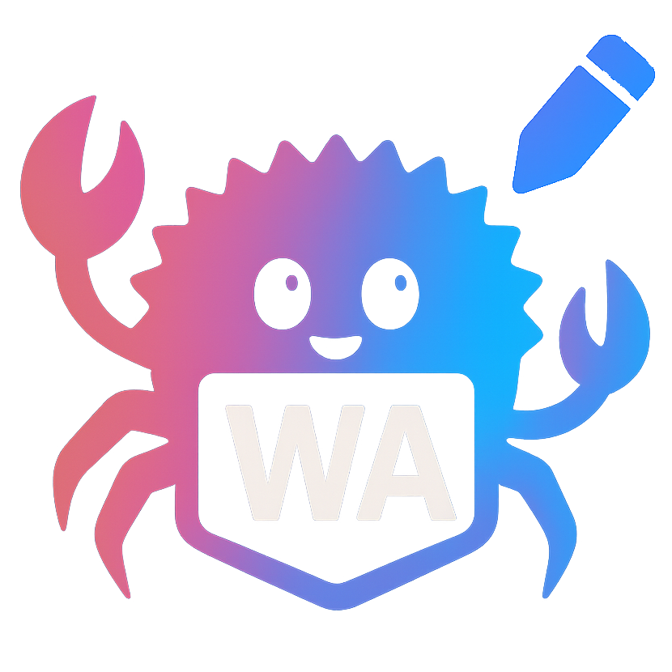

<div align="center">
  
  <h1>WASM Image Studio</h1>
  <p><strong>Web-based image processing studio powered by Rust, WebAssembly, Leptos, and DaisyUI</strong></p>
  <p>
    <a href="#features">Features</a> •
    <a href="#tech-stack">Tech Stack</a> •
    <a href="#getting-started">Getting Started</a> •
    <a href="#contributing">Contributing</a>
  </p>
</div>

## 🖼️ Overview

WASM Image Studio is a high-performance, web-based application for applying a variety of image filters and effects in real time. Built with Rust and compiled to WebAssembly, it delivers near-native performance in your browser. The app features a modern drag-and-drop interface, instant filter previews, and export capabilities for your edited images.

## ✨ Features

- **Modern UI**: Clean, responsive interface built with DaisyUI and Tailwind CSS
- **Dark/Light Mode**: Toggle between themes
- **Drag & Drop**: Upload images by dragging and dropping onto the canvas
- **Real-time Filter Previews**: Instantly see changes as you adjust settings
- **Multiple Filter Types**: Grayscale, Sepia, Blur, Brightness, Contrast, Hue rotation, Saturation, Invert, Edge detection, Sharpen
- **Adjustable Intensity**: Fine-tune each filter with precision controls
- **Responsive Design**: Works on desktop and mobile
- **Export**: Save edited images as PNG, JPEG, or WEBP
- **Accessibility**: Built with accessible design in the mind

## 🚀 Deployment

Deployment to GitHub Pages is automated. Every push to the `main` branch will trigger deployment to the `gh-pages` branch in the `wasm-image-studio-rs/` directory.

### Manual Deployment

1. Build the project:
   ```bash
   trunk build --release
   ```
2. Copy the build output to the deployment directory:
   ```bash
   mkdir -p wasm-image-studio-rs
   cp -r dist/* wasm-image-studio-rs/
   ```
3. Switch to the `gh-pages` branch and copy the files:
   ```bash
   git checkout gh-pages
   git pull
   rm -rf wasm-image-studio-rs
   mkdir -p wasm-image-studio-rs
   cp -r ../dist/* wasm-image-studio-rs/
   git add wasm-image-studio-rs
   git commit -m "Update wasm-image-studio-rs"
   git push origin gh-pages
   ```

The app will be available at: `https://automataia.github.io/wasm-image-studio-rs/`

### Local Development

To run locally:
```bash
trunk serve --open
```

## 🛠️ Tech Stack

- **Frontend**: Rust + WebAssembly
- **Framework**: Leptos
- **Styling**: Tailwind CSS, DaisyUI
- **Image Processing**: photon-rs
- **Build Tool**: Trunk
1. **Prerequisites**
   - [Rust](https://www.rust-lang.org/tools/install)
   - [Trunk](https://trunkrs.dev/)
   - [wasm32-unknown-unknown target](https://rustwasm.github.io/wasm-bindgen/whirlwind-tour/basic-optimizations.html)

2. **Installation**
   ```bash
   # Install Trunk
   cargo install trunk wasm-bindgen-cli
   
   # Add WebAssembly target
   rustup target add wasm32-unknown-unknown
   ```

3. **Development**
   ```bash
   # Start development server
   trunk serve --open
   ```

4. **Build for Production**
   ```bash
   trunk build --release
   ```

  - Hue rotation
  - Saturation adjustment
  - Invert colors
  - Edge detection
  - Sharpen
- **Adjustable Intensity** - Fine-tune each filter with precision controls
- **Responsive Design** - Works on both desktop and mobile devices
- **Export Functionality** - Save your edited images in multiple formats (PNG, JPEG, WEBP)
- **Accessible** - Built with accessibility in mind

## 🛠️ Tech Stack

- **Frontend Framework**: [Leptos](https://leptos.dev/) (v0.8) - Full-stack web framework for Rust
- **UI Components**: [DaisyUI](https://daisyui.com/) (v4.12.0) - Clean, customizable component library
- **Styling**: [Tailwind CSS](https://tailwindcss.com/) (v3.4.3) - Utility-first CSS framework
- **Image Processing**: `photon-rs` - High-performance image processing in Rust
- **Build Tool**: [Trunk](https://trunkrs.dev/) - WASM web application bundler
- **Language**: Rust with WebAssembly for near-native performance

## 🚀 Getting Started

### Prerequisites

- [Rust](https://www.rust-lang.org/tools/install) (latest stable version, 1.70+ recommended)
- [Node.js](https://nodejs.org/) (v18 or later)
- [Trunk](https://trunkrs.dev/) (Rust WASM web application bundler)
- [wasm-bindgen](https://rustwasm.github.io/wasm-bindgen/) (for WebAssembly interop)

### Installation

1. Clone the repository:
   ```bash
   git clone https://github.com/your-username/wasm-image-studio-rs.git
   cd wasm-image-studio-rs
   ```

2. Install Rust WebAssembly target:
   ```bash
   rustup target add wasm32-unknown-unknown
   ```

3. Install Trunk and wasm-bindgen:
   ```bash
   cargo install trunk wasm-bindgen-cli
   ```

4. Install Node.js dependencies:
   ```bash
   npm install
   ```

## 🚧 Development

### Running Locally

Start the development server with hot-reloading:

```bash
trunk serve --open
```

The application will be available at `http://localhost:3000` and will automatically reload when you make changes.

### Building for Production

Create an optimized production build:

```bash
trunk build --release
```

The production-ready files will be in the `dist/` directory.

### Project Structure

```
wasm-image-studio-rs/
├── src/
│   ├── components/     # Reusable UI components
│   │   ├── drag_drop.rs      # File upload component
│   │   ├── filter_controls.rs # Filter controls panel
│   │   ├── image_canvas.rs    # Image display and processing
│   │   └── export_panel.rs    # Image export controls
│   │
│   ├── pages/          # Application pages
│   │   └── home.rs     # Main application page
│   │
│   ├── filters/        # Image filter implementations
│   ├── lib.rs         # Library root
│   └── main.rs        # Application entry point
│
├── public/            # Static assets
├── styles/            # Global styles
└── index.html         # Main HTML entry point
```

### Styling Guidelines

- Use Tailwind CSS utility classes for styling
- Follow DaisyUI component patterns where possible
- Maintain consistent spacing using Tailwind's spacing scale
- Use semantic HTML elements with appropriate ARIA attributes
- Follow the project's color scheme defined in `tailwind.config.js`

### Testing

Run the test suite with:

```bash
cargo test
```

For end-to-end testing:
```bash
wasm-pack test --headless --firefox
```

## 🤝 Contributing

Contributions are welcome! Please follow these steps:

1. Fork the repository
2. Create a feature branch (`git checkout -b feature/amazing-feature`)
3. Commit your changes (`git commit -m 'Add some amazing feature'`)
4. Push to the branch (`git push origin feature/amazing-feature`)
5. Open a Pull Request

### Code Style

- Follow the [Rust API Guidelines](https://rust-lang.github.io/api-guidelines/)
- Use `rustfmt` for code formatting
- Run `clippy` for linting

## 📝 License

This project is licensed under the MIT License - see the [LICENSE](LICENSE) file for details.

## 🙏 Acknowledgments

- [Leptos](https://leptos.dev/) for the awesome Rust web framework
- [Photon-rs](https://github.com/silvia-odwyer/photon) for image processing
- [Trunk](https://trunkrs.dev/) for WASM application bundling
- All contributors who have helped improve this project

## 🏗️ Project Structure

```
.
# Root
├── Cargo.toml          # Rust project configuration and dependencies
├── Cargo.lock          # Lock file for Rust dependencies
├── index.html          # Main HTML entry point with root element for the WASM app
├── input.css           # Global styles and Tailwind CSS imports
├── Trunk.toml          # Trunk configuration
├── info/               # Project documentation
│   └── structure.md    # Detailed project structure documentation

# Source Code
├── src/
│   ├── components/     # Reusable UI components
│   │   ├── app_layout.rs    # Main application layout
│   │   ├── counter_btn.rs   # Counter button component
│   │   ├── drag_drop.rs     # File upload component
│   │   ├── export_panel.rs  # Image export controls
│   │   ├── filter_controls.rs # Filter adjustment controls
│   │   ├── image_canvas.rs  # Image display and manipulation
│   │   └── mod.rs           # Components module exports
│   │
│   ├── filters/        # Image processing filters
5. Open a Pull Request

## 📄 License

This project is licensed under the MIT License. See the [LICENSE](LICENSE) file for details.

## 🙏 Acknowledgments

- [Leptos](https://leptos.dev/) — Rust full-stack web framework
- [photon-rs](https://github.com/silvia-odwyer/photon) — Image processing
- [Tailwind CSS](https://tailwindcss.com/) — Styling
- [Trunk](https://trunkrs.dev/) — WASM bundler